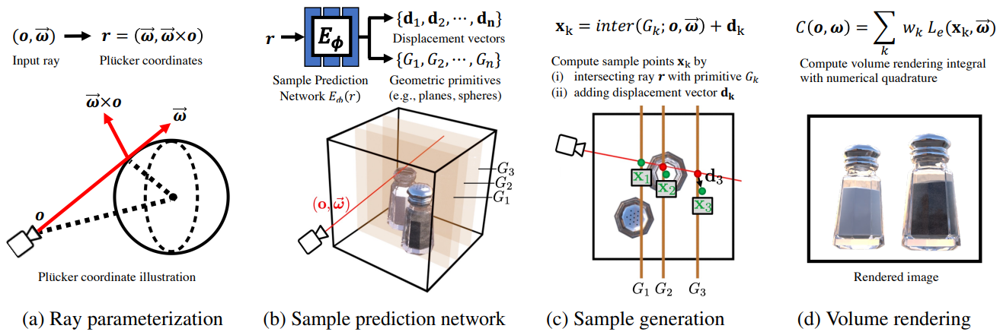

# HyperReel

## [Website](https://hyperreel.github.io/) |  [Paper](https://arxiv.org/abs/2301.02238) | [Video](https://hyperreel.github.io/figures/hyperreel.mp4)



The code of HyperReel is available under the MIT license, as it draws from the following projects, which are also licensed under the MIT license: [nerf_pl](https://github.com/kwea123/nerf_pl), [TensoRF](https://github.com/apchenstu/TensoRF), and [torch-ngp](https://github.com/ashawkey/torch-ngp). Licenses for all of these projects can be found in the `licenses/` folder.


## Table of contents
-----
  * [Installation](#Installation)
  * [Dynamic Datasets](#dynamic-datasets)
  * [Static Datasets](#static-datasets)
  * [Running the Code on Dynamic Scenes](#running-the-code-on-dynamic-scenes)
  * [Running the Code on Static Scenes](#running-the-code-on-static-scenes)
  * [Running the Code with Custom Parameters](#running-the-code-with-custom-parameters)
  * [Real-Time Viewer](#real-time-viewer)
  * [Citation](#Citation)
------


# Installation

To install all required python dependences run

```bash
conda env create -f environment.yml
```

Note that we tested the HyperReel codebase on a machine running Ubuntu 20.04, with an NVIDIA 3090 RTX GPU, CUDA version 11.8, and 128 GB of RAM.

# Dynamic Datasets

By default, we assume that:

1. All datasets are located in the `~/data` folder (specified by the `experiment.params.data_dir` argument)
2. With the subdirectory for each individual dataset specified by the `experiment.dataset.data_subdir` argument (e.g., see `conf/experiment/params/local.yaml` and `conf/experiment/dataset/technicolor.yaml`).

## Technicolor

Please reach out to the authors of [Dataset and Pipeline for Multi-View Light-Field Video](https://ieeexplore.ieee.org/document/8014955) for access to the Technicolor dataset. We use the "undistorted" variants of the following sequences:

* Birthday (frames 150-200)
* Fabien (frames 50-100)
* Painter (frames 100-150)
* Theater (frames 50-100)
* Trains (frames 150-200)

## Google Immersive

Download the Google Immersive sequences from their [release page](https://github.com/augmentedperception/deepview_video_dataset). As an example, in order to download the flames sequence, run:

```
wget https://storage.googleapis.com/deepview_video_raw_data/02_Flames.zip
```

## Neural 3D Video

Download the Neural 3D video sequences from their [release page](https://github.com/facebookresearch/Neural_3D_Video/releases/tag/v1.0). As an example, in order to download the Flame Steak sequence, run:

```
wget https://github.com/facebookresearch/Neural_3D_Video/releases/download/v1.0/flame_steak.zip
```

# Static Datasets

## DoNeRF

The DoNeRF dataset can be found [here](https://repository.tugraz.at/records/jjs3x-4f133).

## LLFF

The LLFF dataset can be found [here](https://drive.google.com/drive/folders/128yBriW1IG_3NJ5Rp7APSTZsJqdJdfc1).

## Shiny

The Shiny dataset can be found [here](https://vistec-my.sharepoint.com/:f:/g/personal/pakkapon_p_s19_vistec_ac_th/EnIUhsRVJOdNsZ_4smdhye0B8z0VlxqOR35IR3bp0uGupQ?e=TsaQgM).

## Spaces

The Spaces dataset can be found [here](https://github.com/augmentedperception/spaces_dataset).

## Stanford

The Stanford dataset can be found [here](http://lightfield.stanford.edu/lfs.html).

# Running the Code on Dynamic Scenes

By default...

1. Checkpoints are written to the `~/checkpoints` folder (specified by the `experiment.params.ckpt_dir` argument)
2. Logs are written to the `~/logs` folder (specified bt the `experiment.params.log_dir` argument).

Note that it can take a few minutes to load all of the training data into memory for dynamic scenes.

## Technicolor

In order to train HyperReel on a 50 frame subset of a scene from the Technicolor dataset, run:

```
bash scripts/run_one_technicolor.sh <gpu_to_use> <scene> <start_frame>
```

By default, the above command will hold-out the central camera. To train a model using all available cameras, run

```
bash scripts/run_one_technicolor_no_holdout.sh <gpu_to_use> <scene> <start_frame>
```

This will also automatically create validation images and (spiral) validation videos in the log folder for the experiment. From a trained model, you can also render a video sequence with:

```
bash scripts/render_one_technicolor.sh <gpu_to_use> <scene> <start_frame>
```

## Google Immersive

In order to train HyperReel on a 50 frame subset of a scene from the Google Immersive dataset, run:

```
bash scripts/run_one_immersive.sh <gpu_to_use> <scene> <start_frame>
```

To reproduce the quantitative results that we report in our paper, you should train a model for *every* 50 frame subset in a video sequence. So, for a 10 second, 300 frame video, you should train models for `start_frame = 0, 50, ..., 250`. Further, each model should be trained for about 1.5 hours (9 hours total for a 10 second, 300 frame video). 

By default, the above command will hold-out the central camera. To train a model using all available cameras, run

```
bash scripts/run_one_immersive_no_holdout.sh <gpu_to_use> <scene> <start_frame>
```

## Neural 3D

In order to train HyperReel on a 50 frame subset of a scene from the Neural 3D Video dataset, run:

```
bash scripts/run_one_n3d.sh <gpu_to_use> <scene> <start_frame>
```

To reproduce the quantitative results that we report in our paper, you should train a model for *every* 50 frame subset in a video sequence. So, for a 10 second, 300 frame video, you should train models for `start_frame = 0, 50, ..., 250`. Further, each model should be trained for about 1.5 hours (9 hours total for a 10 second, 300 frame video). 

By default, the above command will hold-out the central camera. To train a model using all available cameras, run

```
bash scripts/run_one_n3d_no_holdout.sh <gpu_to_use> <scene> <start_frame>
```

# Running the Code on Static Scenes

## DoNeRF

In order to train HyperReel on a scene from the DoNeRF dataset, run:

```
bash scripts/run_one_donerf_sphere.sh <gpu_to_use> <scene>
```

## LLFF

In order to train HyperReel on a scene from the LLFF dataset, run:

```
bash scripts/run_one_llff.sh <gpu_to_use> <scene>
```

## Shiny

In order to train HyperReel on the *CD* and *Lab* sequences from the Shiny dataset, run:

```
bash scripts/run_one_shiny_dense.sh <gpu_to_use> <scene>
```

# Running the Code with Custom Parameters

The general syntax for training a model is:

```
python main.py experiment/dataset=<dataset_config> \
    experiment/training=<training_config> \
    experiment/model=<model_config> \
    experiment.dataset.collection=<scene_name> \
    +experiment/regularizers/tensorf=tv_4000
```

Where

1. `<dataset_config>` specifies the dataset config file, located in `conf/experiment/dataset`
2. `<training_config>` specifies the training config file, located in `conf/experiment/training`
3. `<model_config>` specifies the model config file, located in `conf/experiment/model`
4. `<scene_name>` specifies the scene name within the dataset

## Regularizer syntax

The line `+experiment/regularizers/tensorf=tv_4000` adds total variation and L1 regularizers on the volume tensor components, with configuration located in `conf/experiment/regularizers/tensorf/tv_4000`.

# Real-Time Viewer

Once you have trained a HyperReel model, you can make use of the ```scripts/demo_*``` scripts in order to launch the real-time viewer.

For example, to run the real-time viewer on a scene from the technicolor dataset, run:

```
bash scripts/demo_technicolor.sh <gpu_to_use> <scene> <start_frame>
```

For static scenes, you can omit the start frame argument. For example:

```
bash scripts/demo_shiny_dense.sh <gpu_to_use> <scene>
```

Here are a couple of examples of the demo running on a workstation with a 3090 RTX GPU.

https://user-images.githubusercontent.com/2993881/208320757-439928a1-4d35-4625-afe7-56e7c1eaa57c.mov

https://user-images.githubusercontent.com/2993881/208320798-445fec87-54f1-4335-b345-804a7b2183fe.mov


# Citation

```
@article{attal2023hyperreel,
  title   = {{HyperReel}: {H}igh-Fidelity {6-DoF} Video with Ray-Conditioned Sampling},
  author  = {Attal, Benjamin and Huang, Jia-Bin and Richardt, Christian and Zollhoefer, Michael and Kopf, Johannes and O'Toole, Matthew and Kim, Changil},
  journal = {arXiv preprint arXiv:2301.02238},
  year    = {2023}
}
```
